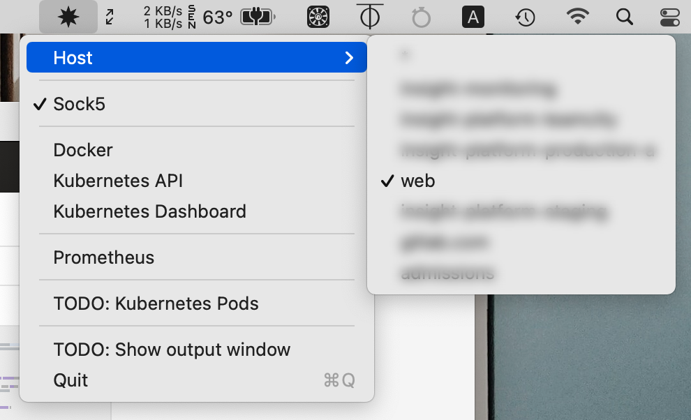

# Bifrost

Menubar application to provide proxy to various services through SSH.

# Why

Sometimes I need a Sock5 proxy to get through BS, and I already have some VPS
running around. The other time I have some services running on VPS that I want
to tunnel to my machine so that I can use them as-if they were running locally,
and I'm too lazy to keep a terminal tab open for each of those service.

# How

Bifrost sits on your menubar, and read your `~/.ssh/config` for list of servers
to connect to. Each time you need a proxy just select the server and enable the
service. There's no step 3™.

Behind the scene, what the app really does is to create a SSH tunnel to your
server, with the correct mapping port-to-port. It is the equivalent of running

    ssh -CN -L <port>:127.0.0.1:<port> <remote_ip>

# Screenshot

# Roadmap

- [ ] Kubernetes Pod And Service Discovery
- [ ] Automatic startup
- [ ] Configuration: allow to define new services and servers, without relying
      on =~/.ssh/config=. We might need this since currently we're not sandbox
      friendly
- [ ] Logging console
- [ ] AppStore release

# License

Copyright 2021 Tung Dao

Licensed under the Apache License, Version 2.0 (the "License"); you may not use
this file except in compliance with the License. You may obtain a copy of the
License at

http://www.apache.org/licenses/LICENSE-2.0

Unless required by applicable law or agreed to in writing, software distributed
under the License is distributed on an "AS IS" BASIS, WITHOUT WARRANTIES OR
CONDITIONS OF ANY KIND, either express or implied. See the License for the
specific language governing permissions and limitations under the License.
